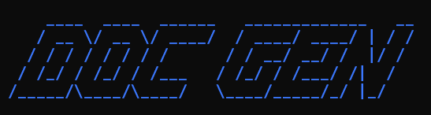
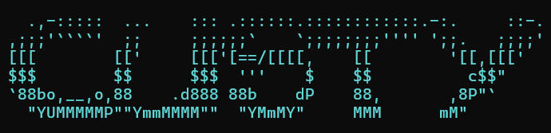

# Hi, I'm Devalltect00 👋

<picture>
  <source media="(prefers-color-scheme: dark)" srcset="https://scribesvg.vercel.app/api/render?lines=Full+Stack+Developer;Turning+ideas+into+reliable+software;Pause+%C2%B7+Think+%C2%B7+Act;Python+%7C+TypeScript+%7C+Go&amp;gradient=D81B85%2C4DD9FF%2C3A7BFF&amp;background=transparent&amp;center=true&amp;font=Fira+Code&amp;size=24">
  <source media="(prefers-color-scheme: light)" srcset="https://scribesvg.vercel.app/api/render?lines=Full+Stack+Developer;Turning+ideas+into+reliable+software;Pause+%C2%B7+Think+%C2%B7+Act;Python+%7C+TypeScript+%7C+Go&amp;gradient=99015B%2C3FCAFF%2C014C68&amp;background=transparent&amp;center=true&amp;font=Fira+Code&amp;size=24">
  
</picture>

I turn ideas and spare-time experiments into web apps, desktop apps, APIs, and developer tools. I mostly build solo, sometimes with a team, and enjoy keeping the process creative, curious, and fun. Contributions and creative ideas are welcome.

Explore selected projects, experiments, and the ideas behind the tools I build.

## 🧰 Technology stack

### Languages

<picture>
  <source media="(prefers-color-scheme: dark)" srcset="https://skillicons.dev/icons?i=python%2Cjs%2Cts%2Cgo%2Cphp%2Cjava%2Ccpp%2Ccs&amp;theme=dark">
  <source media="(prefers-color-scheme: light)" srcset="https://skillicons.dev/icons?i=python%2Cjs%2Cts%2Cgo%2Cphp%2Cjava%2Ccpp%2Ccs&amp;theme=light">
  
</picture>

### Frontend and mobile

<picture>
  <source media="(prefers-color-scheme: dark)" srcset="https://skillicons.dev/icons?i=react%2Cnextjs%2Ctailwind%2Csass%2Cvite%2Castro&amp;theme=dark">
  <source media="(prefers-color-scheme: light)" srcset="https://skillicons.dev/icons?i=react%2Cnextjs%2Ctailwind%2Csass%2Cvite%2Castro&amp;theme=light">
  
</picture>

Building web interfaces with React and cross-platform applications with React Native.

### Backend and automation

<picture>
  <source media="(prefers-color-scheme: dark)" srcset="https://skillicons.dev/icons?i=flask%2Cfastapi%2Claravel%2Cnodejs&amp;theme=dark">
  <source media="(prefers-color-scheme: light)" srcset="https://skillicons.dev/icons?i=flask%2Cfastapi%2Claravel%2Cnodejs&amp;theme=light">
  
</picture>
&nbsp;

Including web scraping and crawling workflows.

### Desktop and productivity

&nbsp;

Microsoft Excel and LinkedIn icons by <a href="https://icons8.com">Icons8</a>.

### Data

<picture>
  <source media="(prefers-color-scheme: dark)" srcset="https://skillicons.dev/icons?i=mysql%2Cpostgres%2Cmongodb&amp;theme=dark">
  <source media="(prefers-color-scheme: light)" srcset="https://skillicons.dev/icons?i=mysql%2Cpostgres%2Cmongodb&amp;theme=light">
  
</picture>

### Platform, delivery, documentation, and design

<picture>
  <source media="(prefers-color-scheme: dark)" srcset="https://skillicons.dev/icons?i=docker%2Cgit%2Cgithub%2Cgitlab%2Clinux%2Cfigma%2Carduino&amp;theme=dark">
  <source media="(prefers-color-scheme: light)" srcset="https://skillicons.dev/icons?i=docker%2Cgit%2Cgithub%2Cgitlab%2Clinux%2Cfigma%2Carduino&amp;theme=light">
  
</picture>
&nbsp;

Also working with Docker Compose, GitHub CLI, and GitLab CLI.

## 🚀 Featured projects

<table align="center" width="98%">
  <tr>
    <td width="50%" align="center" valign="top">
      <h3>Path Header Scanner</h3>
      
      
Preview, validate, and apply consistent repository-relative path headers across source code and documentation.

      
      
    </td>
    <td width="50%" align="center" valign="top">
      <h3>Doc Gen</h3>
      
      
Generate, print, and analyze repository-structure documentation in Markdown.

      
      
    </td>
  </tr>
  <tr>
    <td width="50%" align="center" valign="top">
      <h3>Reflow</h3>
      
      
Convert repository tags, recover release automation, and publish tagged container images through repository-aware workflows.

      
      
    </td>
    <td width="50%" align="center" valign="top">
      <h3>Custy</h3>
      
      
Automate Git workflows, versioning, changelogs, backups, cleanup, and release delivery through configurable development pipelines.

      
      
    </td>
  </tr>
</table>

## 📊 GitHub activity

<table align="center" width="98%">
  <tr>
    <td width="50%" align="center">
      <picture>
        <source
          media="(prefers-color-scheme: dark)"
          srcset="https://github-stats-extended.vercel.app/api?username=devalltect00&amp;show_icons=true&amp;include_all_commits=true&amp;hide_rank=true&amp;custom_title=GitHub%20Activity&amp;title_color=D81B85&amp;text_color=F8FAFC&amp;icon_color=4DD9FF&amp;border_color=2B3648&amp;bg_color=00000000"
        >
        <source
          media="(prefers-color-scheme: light)"
          srcset="https://github-stats-extended.vercel.app/api?username=devalltect00&amp;show_icons=true&amp;include_all_commits=true&amp;hide_rank=true&amp;custom_title=GitHub%20Activity&amp;title_color=99015B&amp;text_color=0F172A&amp;icon_color=014C68&amp;border_color=CBD5E1&amp;bg_color=00000000"
        >
        
      </picture>
    </td>
    <td width="50%" align="center">
      <picture>
        <source
          media="(prefers-color-scheme: dark)"
          srcset="https://github-stats-extended.vercel.app/api/top-langs?username=devalltect00&amp;layout=compact&amp;title_color=D81B85&amp;text_color=F8FAFC&amp;icon_color=4DD9FF&amp;border_color=2B3648&amp;bg_color=00000000"
        >
        <source
          media="(prefers-color-scheme: light)"
          srcset="https://github-stats-extended.vercel.app/api/top-langs?username=devalltect00&amp;layout=compact&amp;title_color=99015B&amp;text_color=0F172A&amp;icon_color=014C68&amp;border_color=CBD5E1&amp;bg_color=00000000"
        >
        
      </picture>
    </td>
  </tr>
</table>

## 🐍 Contributions

<picture>
  <source media="(prefers-color-scheme: dark)" srcset="https://raw.githubusercontent.com/devalltect00/devalltect00/output/github-contribution-grid-snake-dark.svg">
  <source media="(prefers-color-scheme: light)" srcset="https://raw.githubusercontent.com/devalltect00/devalltect00/output/github-contribution-grid-snake.svg">
  
</picture>

## 🤝 Connect

&nbsp;&nbsp;

&nbsp;&nbsp;

&nbsp;&nbsp;

&nbsp;&nbsp;

---

<em>Pause · Think · Act</em>

